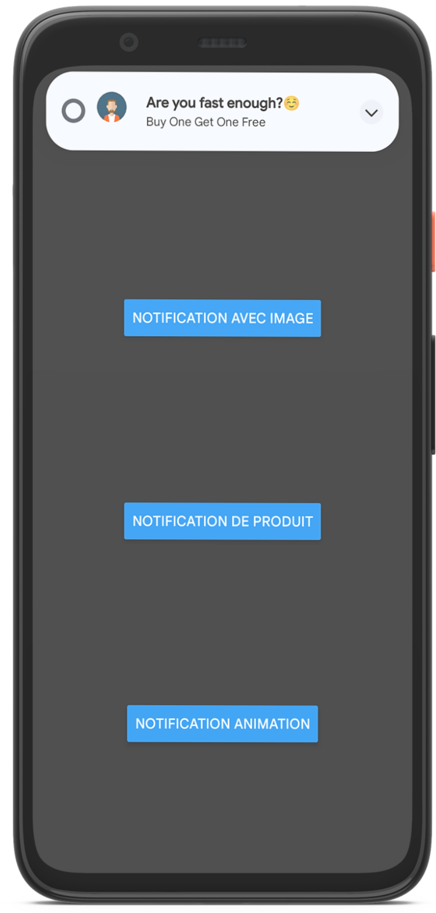
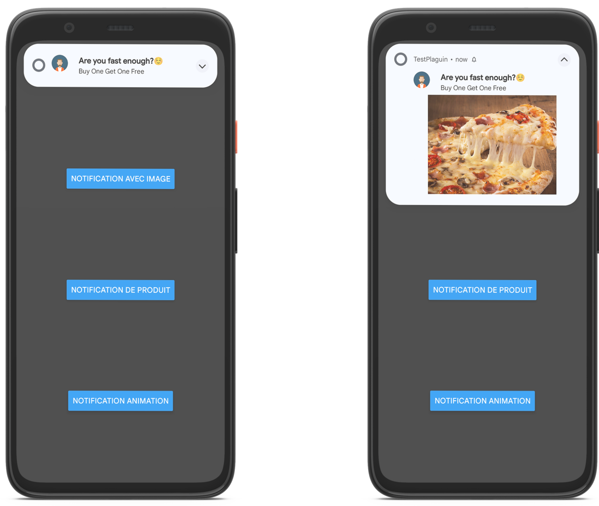
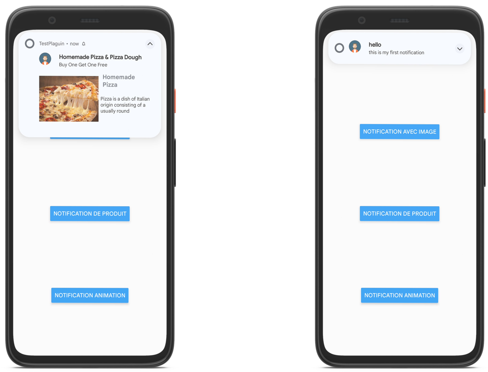
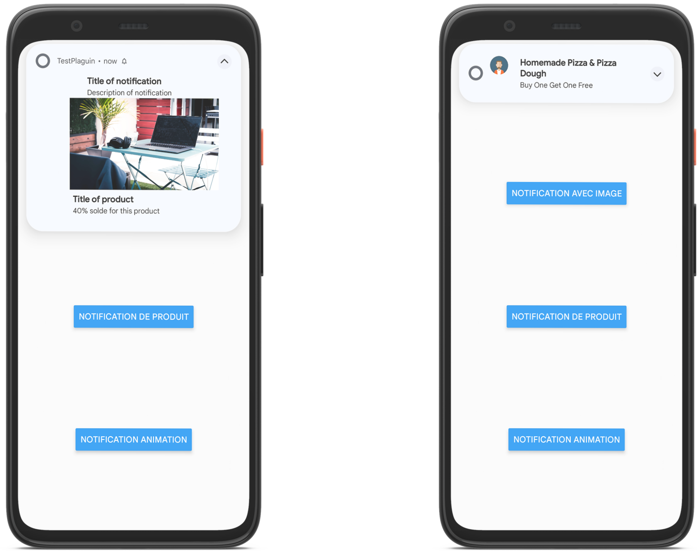

# react-native-custom-notification

Custom push notification SDK

## Installation

```sh
npm install react-native-custom-notification
```
## Usage


```js
import { CreateInformativeNotification } from "react-native-custom-notification";

// ...

CreateInformativeNotification('Title','Description','ImageUrl','DeepLink');
```

# Android manual Installation
In your android/app/src/main/AndroidManifest.xml

```java
<uses-permission android:name="android.permission.VIBRATE" />
<uses-permission android:name="android.permission.RECEIVE_BOOT_COMPLETED"/>
<application ....>
.....
 <service
            android:name="com.reactnativecustomnotification.MyFirebaseMessagingService"
            android:exported="false">
            <intent-filter>
                <action android:name="com.google.firebase.MESSAGING_EVENT" />
            </intent-filter>
</service>
.......
```
In android/build.gradle

```java
buildscript {
    ...
    dependencies {
        ...
        classpath('com.google.gms:google-services:4.3.10')
        ...
    }
}
```
In android/app/build.gradle

```java
apply plugin: 'com.google.gms.google-services'

...

dependencies {
  ...
implementation platform('com.google.firebase:firebase-bom:30.1.0')
implementation 'com.google.firebase:firebase-analytics'
implementation project(':react-native-custom-notification')
  ...
}

```
In android/settings.gradle
```java
...
include(":react-native-custom-notification")
   project(":react-native-custom-notification").projectDir = file('../node_modules/react-native-custom-notification/android')

```
## Demo

Informative Notification



Big Picture Notification



Product Notification



Product Notification




## Contributing

See the [contributing guide](CONTRIBUTING.md) to learn how to contribute to the repository and the development workflow.

## License

MIT
